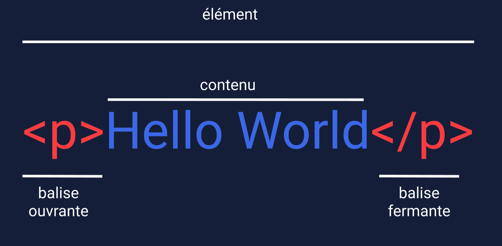

# Anatomie




```html
<p> Hello World ! </p>
```

Le HTML est composé d'éléments. Ces éléments structurent la page web et définissent son contenu. Voyons comment ils sont écrits.

Le code plus haut montre un élément de paragraphe HTML. Comme on peut le voir, l'élément de paragraphe est composé de :

- Une balise d'ouverture (`<p>`)
- Le contenu textuel (\"Hello World !\")
- Une balise de fermeture ( `</p>`)

Une balise d'ouverture et de fermeture ainsi que le contenu qui s'y trouve est appelé un **élément HTML**. Il existe de nombreuses balises que nous pouvons utiliser pour organiser et afficher du texte et d'autres types de contenu, comme les images.

Passons rapidement en revue chaque partie de l'élément illustré :
- **Élément HTML** (ou simplement, élément) - une unité de contenu dans un document HTML formée par les balises HTML et le texte ou le média qu'il contient.
- **Balise HTML** - le nom de l'élément, entouré d'un chevron d'ouverture (<) et de fermeture (>).
- **Balise d'ouverture** - la première balise HTML utilisée pour démarrer un élément HTML. Le type de balise est entouré de crochets ouvrants et fermants.
Contenu - l'information (texte ou autres éléments) contenue entre les balises d'ouverture et de fermeture d'un élément HTML.
- **Balise de fermeture** - la deuxième balise HTML utilisée pour terminer un élément HTML. Les balises de fermeture comportent une barre oblique (/), juste après le chevron gauche.


## Quelques réflexions

1. L'élément de cet exercice contient du texte mais les éléments peuvent-ils contenir d'autres types de contenu ? Si oui, quels types de contenu un élément HTML peut-il contenir ?
    - Bien qu'un élément de phrase ou de mot n'existe pas, un développeur qui souhaite avoir un contrôle plus fin sur un morceau de paragraphe comme un mot, une phrase ou un caractère peut utiliser un élément comme `<span>`, `<em>` ou `<strong>` pour cibler plus spécifiquement le contenu. Vous en apprendrez plus sur chacune de ces balises et sur leurs cas d'utilisation dans les exercices à venir. Pour l'instant, sachez simplement qu'elles existent et qu'elles peuvent être utilisées pour cibler des phrases, des mots ou des caractères dans un paragraphe ou même pour cibler des paragraphes entiers dans des articles plus importants. En d'autres termes, les développeurs peuvent utiliser ces balises pour contrôler la granularité du contenu ciblé.  

    - Cela dépend de l'élément. Comme vous l'apprendrez, les éléments `<p>`, `<div>` et `<span>` peuvent contenir du texte alors que des éléments comme ``<ul>`` ou `<ol>` ne doivent contenir que des éléments `<li>` en tant qu'enfants directs Les balises de niveau bloc (comme `<div>`) peuvent contenir toutes les balises qui peuvent exister dans le `<body>` (en d'autres termes, nous pouvons imbriquer d'autres éléments dans un `<div>`) alors que les balises à fermeture automatique comme `` ne peuvent contenir aucun contenu !

2. Dans cet exemple, les balises `<p>` comptent-elles aussi comme du contenu ou le contenu est-il seulement la phrase contenue dans les balises ?
    - Le contenu n'est que l'information contenue entre les balises elles-mêmes. Les balises marquent ce contenu afin que le navigateur sache comment interpréter et structurer correctement ces informations. Comme vous l'apprendrez plus tard dans cette leçon, le contenu n'est pas toujours entre une balise d'ouverture et de fermeture. Par exemple, la balise `` est un exemple de balise à fermeture automatique et elle introduit le contenu dans la page différemment de l'élément `<p>`.
    

___
| [Précédent](./1-introduction.md)       | [Suivant](./3-body.md)        |


