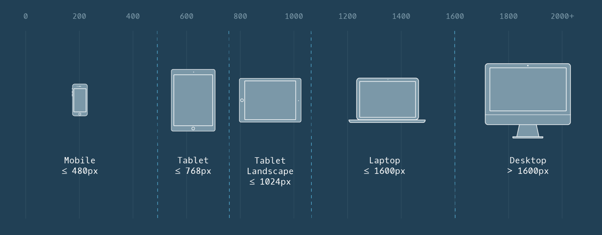

# Point d'arrêt ou Breakpoint

Nous savons comment utiliser les requêtes médias pour appliquer les règles CSS basées sur la taille et la résolution de l'écran, mais comment déterminer les requêtes à définir ?

Les points auxquels les requêtes médias sont définies sont appelés points d'arrêt. Les points d'arrêt sont les tailles d'écran auxquelles votre page web n'apparaît pas correctement. Par exemple, si nous voulons cibler les tablettes qui sont en orientation paysage, nous pouvons créer le point d'arrêt suivant :

```css
@media only screen and (min-width: 768px) and (max-width: 1024px) and (orientation: landscape) {
    /* CSS ruleset */
}
```

L'exemple ci-dessus crée une plage de taille d'écran de la taille d'une tablette en mode paysage et identifie également l'orientation.

Cependant, il serait incroyablement difficile de définir des points de rupture pour tous les appareils imaginables, car il existe de nombreux appareils de formes et de tailles différentes. En outre, de nouveaux appareils sont lancés chaque année avec de nouvelles tailles d'écran.

Plutôt que de définir des points d'arrêt en fonction de dispositifs spécifiques, la meilleure pratique consiste à redimensionner votre navigateur pour afficher les endroits où le site web se brise naturellement en fonction de son contenu. Les dimensions auxquelles la mise en page se brise ou paraît étrange deviennent les points d'arrêt de votre requête média. À l'intérieur de ces points d'arrêt, nous pouvons ajuster le CSS pour faire en sorte que la page soit redimensionnée et réorganisée.

En observant les dimensions auxquelles un site web se brise naturellement, vous pouvez définir des points d'arrêt pour les requêtes média qui créent la meilleure expérience utilisateur possible, projet par projet, plutôt que de forcer chaque projet à s'adapter à une certaine taille d'écran. Les différents projets ont des besoins différents, et la création d'un design adapté ne devrait pas être différente.
___

___
Utilisez-l'image ci-dessus comme référence pour tester votre site web afin de vous assurer qu'il est bien adapté à différents types d'appareils.

## A vous de jouer !

1. Reprendre votre code.

2. Le dernier point de rupture que nous voudrions prendre en compte est une tablette sur l'orientation du paysage. Le site web Amazing Space devrait changer de format pour afficher les photos de la galerie à droite, tout en ayant le logo et la description à gauche.
   - Rédigez une requête média qui réponde aux exigences suivantes :
      - L'écran a une largeur minimale `min-width` de `768px`.
      - L'écran a une largeur maximale `max-width` de `1024px`.
      - L'écran a une orientation paysage `landscape`.
      
3. A l'intérieur de la requête média, inclure ce CSS :
```css
.page-title, .page-description {
  float: left;
    width: 20em;
}

.page-description {
    text-align: left;
}
```

Ce CSS déplacera le titre et la description de la page à gauche des images de la galerie. Redimensionnez le navigateur pour observer ces changements à différentes largeurs d'écran.

___
| [Précédent](./15-liste-separe-virgule.md)       | [Suivant (projet)](./CafPow!/explications.md)       |
