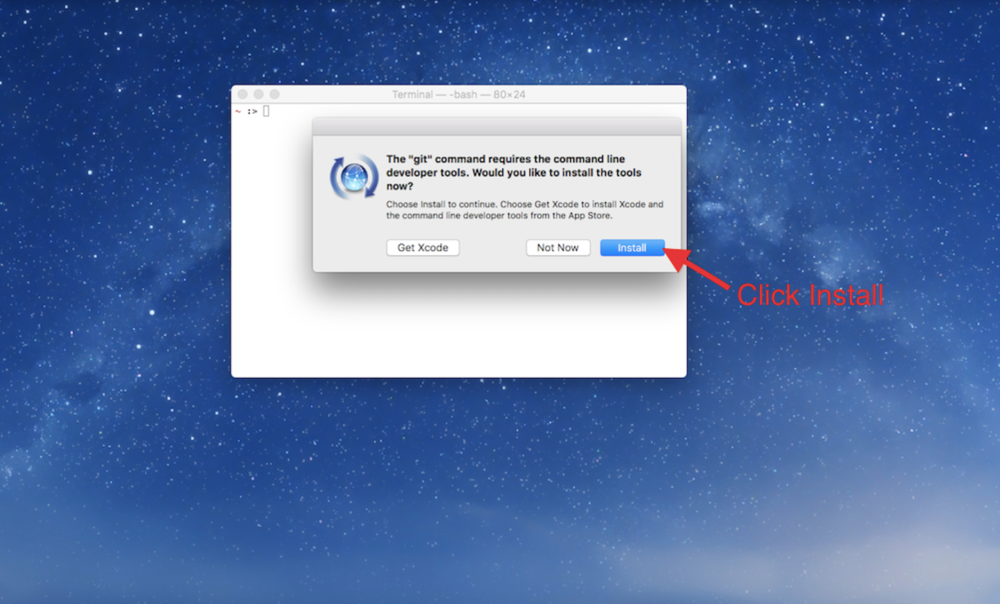
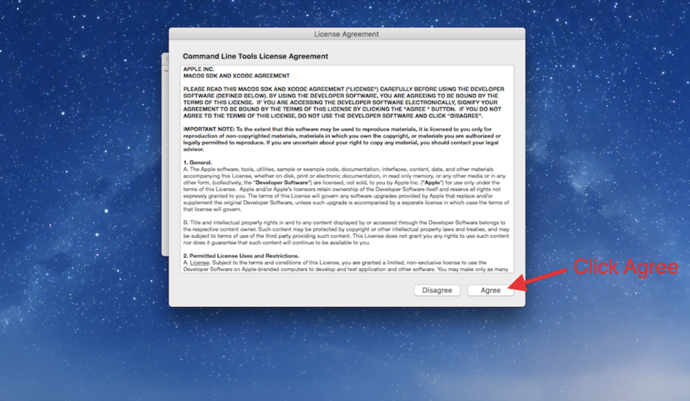
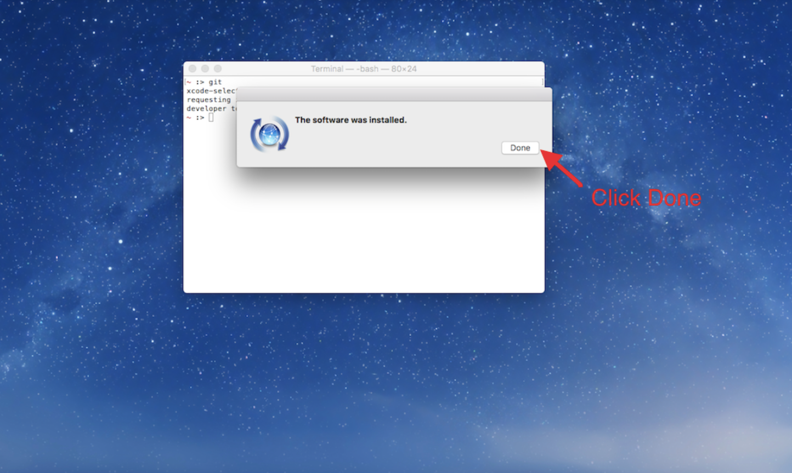
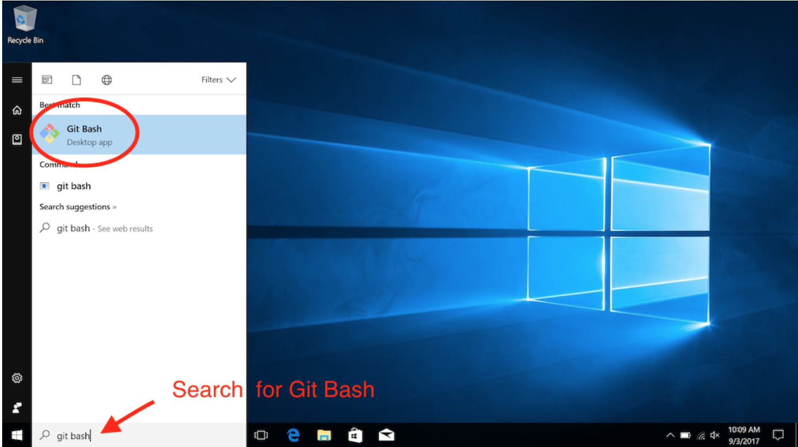
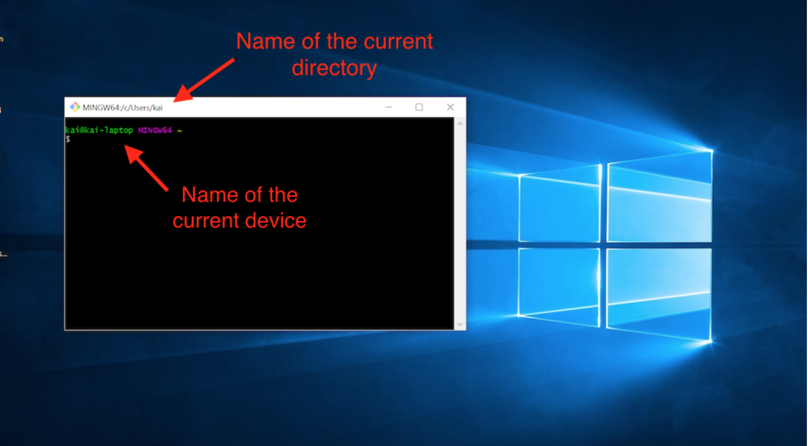
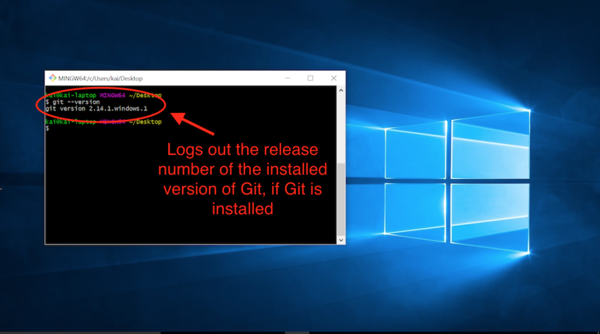
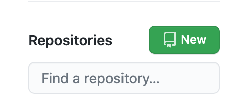
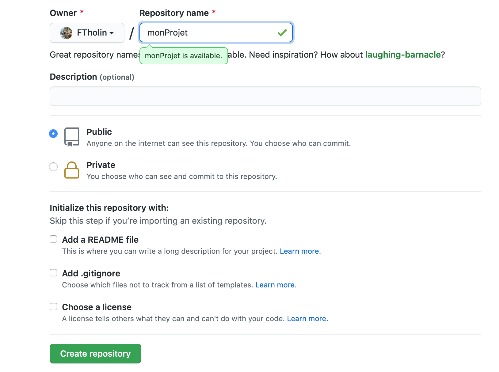
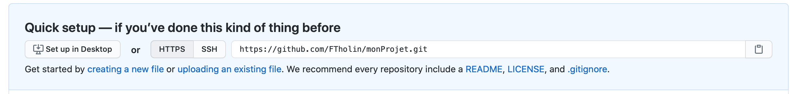
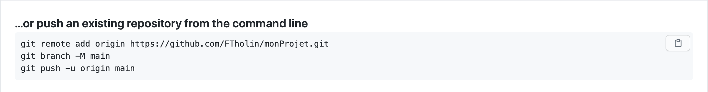

# Mise en place de Git et Github

Dans ce tutoriel, nous expliquons comment utiliser Git en local sur votre ordinateur personnel et comment utiliser GitHub pour le sauvegarder. Plus précisément, nous allons créer votre compte GitHub personnel, installer Git sur votre ordinateur, démarrer votre premier dépôt Git et connecter ce dépôt à un dépôt GitHub.

## Que sont Git et GitHub ?

Ce tutoriel fait référence à Git et GitHub à plusieurs reprises. Git est un système de contrôle de version largement utilisé pour gérer le code. Git vous permet d'enregistrer des brouillons de votre code afin de pouvoir revenir sur les versions précédentes et d'annuler des erreurs compliquées. Un projet géré avec Git est appelé un dépôt Git.

GitHub est un service d'hébergement populaire pour les dépôts Git. GitHub vous permet de stocker vos dépôts Git locaux dans le nuage. Avec GitHub, vous pouvez sauvegarder vos fichiers personnels, partager votre code et collaborer avec d'autres.

En bref, GitHub est un outil pour travailler avec Git. Il existe d'autres services pour héberger des dépôts Git, mais GitHub est un service fiable et gratuit utilisé par des organisations du monde entier, petites et grandes.

## Créer un compte GitHub

Pour utiliser GitHub, vous aurez besoin d'un compte GitHub.

Dans votre propre navigateur :
  1. Ouvrir un nouvel onglet du navigateur
  2. Naviguer sur https://github.com/
  3. Créer un compte

Si vous avez déjà un compte GitHub, passez à l'exercice suivant.

Après votre inscription, vous recevrez un e-mail de vérification. Veillez à vérifier votre adresse électronique sur GitHub en suivant les instructions contenues dans ce courriel.

## Configuration de Git pour Mac et Windows

Ensuite, nous installerons Git sur votre ordinateur personnel. Suivez les instructions relatives à votre système d'exploitation.

### Utilisateurs Mac 

1. Lancez l'application **Terminal**. Vous pouvez la trouver dans `/Applications/Utilitaires/`. Vous pouvez également utiliser l'outil de recherche Spotlight (la petite loupe en haut à droite de votre écran) pour rechercher **Terminal**. Une fois que Spotlight l'a localisé, cliquez sur le résultat qui dit **Terminal**.

2. Lorsque le terminal s'ouvre, tapez `git` et appuyez sur entrée.

3. Si vous n'avez pas encore installé Git, une boîte de dialogue apparaîtra disant que "La commande 'git' nécessite les outils de développement en ligne de commande. Voulez-vous installer les outils maintenant ? Cliquez sur `Installer`.
 

Cliquez ensuite sur "Accepter les conditions de service" lorsque cela vous est demandé.

4. Lorsque le téléchargement est terminé, l'installateur disparaîtra de lui-même, ce qui signifie que Git est maintenant installé ! Cliquez sur "Terminé" pour terminer l'installation.

5. Une des premières choses que vous avez à faire est de paramétrer votre nom et votre adresse de courriel :
  - `git config --global user.name "mon nom ou pseudo"`
  - `git config --global user.email monAdresseEmail`
  
6. GitHub propose deux options d'authentification, HTTPS et SSH, pour sécuriser votre travail. Il s'agit d'une mesure de sécurité qui empêche toute personne non autorisée d'apporter des modifications à votre dépôt GitHub. Dans cet article, nous utiliserons HTTPS.

### Utilisateurs Windows

1. [Installer git sur windows](https://www.stanleyulili.com/git/how-to-install-git-bash-on-windows/)

2. Ouvrez le menu Démarrer et recherchez l'application, git bash. Vous devriez voir apparaître l'application "Git Bash Desktop". Appuyez sur la touche Entrée ou cliquez sur l'icône Git Bash pour ouvrir l'application.

3. Une des premières choses que vous avez à faire est de paramétrer votre nom et votre adresse de courriel :
  - `git config --global user.name "mon nom ou pseudo"`
  - `git config --global user.email monAdresseEmail`

## C'est parti

Vous avez maintenant tout ce dont vous avez besoin pour pratiquer vos compétences en matière de Git sur votre ordinateur local. Prenez un moment pour exécuter les commandes ci-dessous afin d'initialiser un dépôt Git.
Nous utiliserons à nouveau ce dépôt Git plus tard dans ce tutoriel, alors assurez-vous de suivre ces étapes en personnalisant le nom de votre projet.

1. `mkdir nomProjet` crée un nouveau répertoire nommé `nomProjet`
2. `cd nomProjet` se déplacer dans nomProjet ou changer de répertoire courant pour nomProjet
3. `git init` transformer le répertoire vide actuel en un nouveau dépôt Git.
4. `echo "Bonjour Git et GitHub" >> README.txt` créer un nouveau fichier README (nous y reviendrons plus tard) avec un exemple de texte.
5. `git add README.txt` pour ajouter le nouveau fichier à la zone de transit de Git.
6. `git commit -m "Premier commit"` pour faire votre premier commit avec le nouveau fichier README.

## Dépôt GitHub

nous allons créer un dépôt sur GitHub et le relier à un dépôt local sur votre ordinateur. Cela vous permet de sauvegarder votre travail en permanence et en toute sécurité, de sorte que vous n'ayez plus jamais à craindre de perdre votre travail !

Maintenant, connectons notre dépôt local Git à GitHub.

### Étapes

1. Dans votre interface de ligne de commande, assurez-vous que votre répertoire de travail actuel est votre nouveau dépôt Git. Si ce n'est pas le cas, naviguez dans ce répertoire.

2. Vérifiez le statut des fichiers et des dossiers qui sont nouveaux ou qui ont été modifiés. Aucun fichier ne doit avoir été modifié.
`git status`

3. Sur GitHub, créez un nouveau dépôt en cliquant sur le bouton Nouveau dépôt sur la page d'accueil.

4. Sur la page du nouveau dépôt, donnez un nom à votre dépôt. Ce n'est pas nécessaire, mais il serait pratique de lui donner le même nom que le répertoire local `nomProjet`. Après avoir donné un nom au dépôt, cliquez sur Créer un dépôt.

5. Après avoir créé un dépôt, GitHub affiche la page du dépôt. En haut de la page, assurez-vous que "HTTPS" est sélectionné.

6. Le dépôt est vide, il est donc temps de le connecter à votre travail existant. Copiez les commandes Git sur la page GitHub, sous le titre "...ou poussez un dépôt existant depuis la ligne de commande", et collez-les dans votre interface de ligne de commande. L'exécution de ces commandes ajoutera un dépôt distant, puis poussera votre dépôt local vers le dépôt distant.

Lorsqu'on vous demande un nom d'utilisateur et un mot de passe, tapez votre nom d'utilisateur et votre mot de passe GitHub et appuyez sur la touche Entrée après chacun. Ne vous inquiétez pas si vous ne pouvez pas voir les caractères que vous tapez, ils sont intentionnellement cachés par mesure de sécurité.

7. Une fois que votre interface de ligne de commande signale que la poussée est terminée, rafraîchissez la page sur GitHub. Vous devriez maintenant voir le texte que vous avez écrit plus tôt dans le fichier README, "Bonjour Git et GitHub".

GitHub affiche automatiquement le contenu d'un fichier nommé README.txt s'il existe dans le dépôt. Le fichier README est l'endroit idéal pour écrire une description de votre projet.

Vous l'avez là ! Votre premier dépôt GitHub, lié à votre dépôt Git local. Vous avez fait des pas de géant, alors soyez fier ! Maintenant, vous pouvez utiliser votre connaissance de Git pour suivre les progrès sur votre ordinateur local, et `push` ces projets !

___
| [Précédent](../4-transitions-css/jules-verne/explications.md)       | [Suivant](./2-deploiment-githubpages.md)    |
