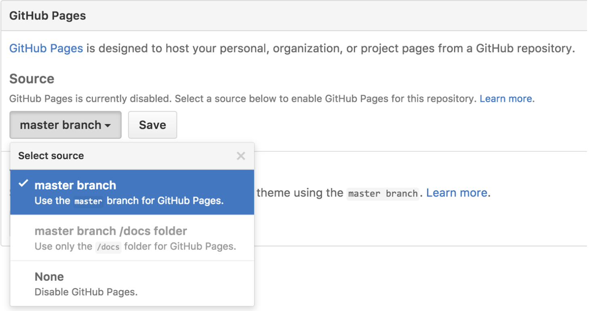

# Déploiement sur Github Pages

GitHub est un excellent outil pour stocker des projets et collaborer avec d'autres, mais son utilité ne s'arrête pas là. Nous utiliserons un service appelé GitHub Pages pour partager nos créations de pages web sur le World Wide Web.

## Qu'est-ce que Github Pages ?

Il existe de nombreuses façons de déployer un site web sur l'internet public. Nous utiliserons le service gratuit de GitHub appelé GitHub Pages.

GitHub Pages offre de nombreuses fonctionnalités et une grande flexibilité, le tout gratuitement. Voici quelques-uns des avantages qu'il offre :
- Une installation facile
- Une collaboration sans faille grâce à Git et GitHub
- Hébergement gratuit avec >95% de temps de fonctionnement
- Mise à jour en direct avec le flux de travail normal de GitHub

## Qu'est-ce que le déploiement ?

Déployer, c'est comme publier.
Lorsque les auteurs sont prêts à ce que leur travail soit vu par le monde, ils le publient. Lorsque les développeurs web sont prêts à partager leurs projets, ils les déploient sur le web.
On parle de déploiement lorsqu'un projet est regroupé et partagé sur Internet. 
Contrairement à la publication, cependant, le déploiement peut se produire plusieurs fois au cours d'un projet logiciel.

## Déployez !

Le déploiement sur les pages GitHub est automatique. Une fois qu'il est mis en place, le déploiement se fait à chaque fois que vous poussez vos modifications locales vers votre dépôt distant, hébergé par GitHub. 
Consultez les instructions de configuration des pages GitHub et suivez exactement les [étapes](https://pages.github.com) pour obtenir la configuration de votre page GitHub principale.

Lorsque vous naviguez pour la première fois sur votre site nouvellement déployé, il est possible que vous receviez une erreur 404. Si cela se produit, et si vous êtes sûr d'avoir suivi toutes les étapes telles qu'elles ont été écrites, vérifiez à nouveau dans 30 minutes si le déploiement s'est bien déroulé.

## Visualisation de votre page web

C'est tout ! Votre site web est déployé sur l'Internet ! Vous et toute personne avec qui vous partagez ce lien pouvez visualiser votre projet en naviguant dans votre navigateur à l'URL `http://<votre-nom-d'utilisateur-github>.github.io`.

## Ajoutez des projets sur Github Pages

Vous pouvez configurer vos pages GitHub pour déployer chacun de vos dépôts en plus de `<nom d'utilisateur>.github.io`. Cela vous permettra de vous assurer que tous vos sites sont déployés automatiquement chaque fois que vous pousserez sur GitHub.  

Dans GitHub, naviguez vers votre dépôt `<nom d'utilisateur>.github.io` et cliquez sur Paramètres.  
___

Désormais, tous vos dépôts peuvent être trouvés à l'adresse http://`<nomutilisateur>.github.io/<nom-dépôt>`.  
___
Essayez de créer un nouveau dépôt avec un projet HTML à l'intérieur (peut-être en poussant un ancien projet vers GitHub) et ensuite naviguez vers la page déployée.

## Déployez les nouveaux changements
Maintenant que votre site GitHub Pages est mis en place, il est facile de déployer de nouveaux changements. Chaque fois que vous apportez une modification à votre site, utilisez le flux normal de GitHub. C'est-à-dire, utilisez git commit et git push pour envoyer vos modifications à GitHub. Après cela, le site GitHub devrait se mettre à jour en quelques secondes. Il suffit de rafraîchir la page dans votre navigateur, et vous pouvez y aller !
Félicitations pour votre première page web en direct !

___
| [Précédent](./1-mise-en-place-git.md)       | [Suivant](./3-projet-final.md)    |
