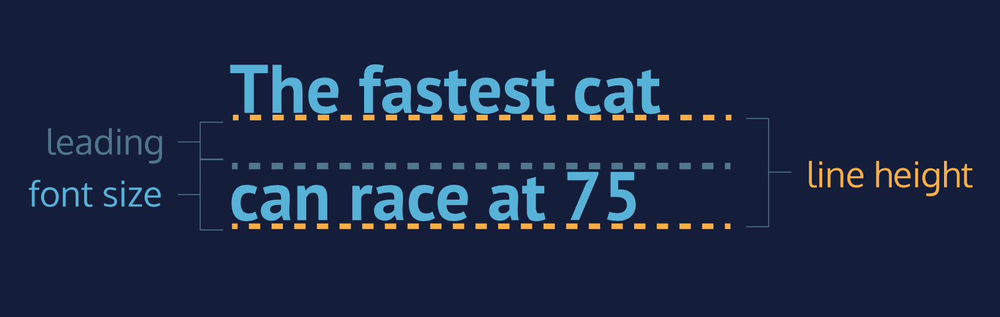

# Hauteur de ligne

Une autre propriété que nous pouvons définir pour le texte est `line-height`. Cette propriété modifie le début du texte.

Le diagramme ci-dessous permet d'illustrer la signification des termes "début de ligne" et "hauteur de ligne".

___
### Fig3

___

Nous modifions souvent `line-height` pour rendre le texte d'une page web plus facile à lire. Lorsque le texte est stylisé pour apparaître plus grand, l'espacement vertical entre les lignes de texte peut diminuer, créant ainsi un texte difficile à lire, en particulier dans les paragraphes.

Nous pouvons utiliser `line-height` pour définir la hauteur de la ligne contenant notre texte, quelle que soit la hauteur du texte. La hauteur des lignes peut prendre une ou plusieurs valeurs :

1. Un nombre sans unité, tel que `1.2`. Ce nombre est une valeur absolue qui permet de calculer la hauteur de la ligne par rapport à la taille de police.

2. Un nombre spécifié par unité, par exemple `12px`. Ce nombre peut être n'importe quelle unité CSS valide, comme les pixels, les pourcentages, les ems ou les rems.

En général, la valeur du ratio sans unité est la méthode préférée, car elle est sensible et basée exclusivement sur la taille de la police actuelle. En d'autres termes, si nous modifions la taille de la police, `line-height` sans unité se réajustera automatiquement, tandis que la valeur en pixels restera statique.

```css
p {
  line-height: 1.4;
}
```

## A vous de jouer !

1. Reprendre votre code.

2. Changeons la hauteur de ligne du texte dans la bannière.
    - Dans `style.css`, fixez la hauteur de ligne de l'élément  paragraphe dans la classe de bannière à `1.4`. Vous remarquerez que la hauteur de ligne augmente.

___

| [Précédent](./7-alignement-texte.md)       | [Suivant](./9-empattement.md)       |
