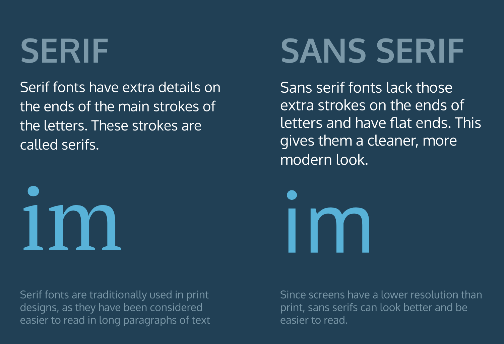

# Empattement et Sans Empattement

Vous avez appris beaucoup de propriétés pour modifier le texte d'une page web !

Dans l'exercice suivant, vous allez définir un texte avec ou sans **empattement**. Que signifient exactement ces mots ?

- **Serif**
  - Sont des polices qui comportent des détails supplémentaires à la fin de chaque lettre. Il s'agit par exemple de polices comme **Times New Roman** ou **Georgia**, entre autres.

- **Sans-Serif**
  - Sont des polices qui ne comportent pas de détails supplémentaires aux extrémités de chaque lettre. Les lettres ont plutôt des bords droits et plats, comme l'**Arial** ou l'**Helvetica**.

___
### Fig4

___
Que se passe-t-il lorsqu'une feuille de style nécessite une police qui n'est pas installée sur l'ordinateur d'un utilisateur ? La plupart des ordinateurs ont un petit ensemble de polices de caractères pré-installées. Ce petit ensemble comprend des polices à empattement comme la `Times New Roman` et des polices sans empattement comme l'`Arial`.

Ces polices pré-installées servent de polices de secours si la feuille de style spécifie une police qui n'est pas installée sur l'ordinateur d'un utilisateur.

Pour utiliser des polices de secours, la syntaxe suivante est nécessaire :

```css
h1 {
  font-family: "Garamond", "Times", serif;
}
```

La règle CSS ci-dessus dit :

- Utilisez la police `Garamond` pour tous les éléments `<h1>` de la page.
- Si la police `Garamond` n'est pas disponible, utilisez la police `Times`.
- Si les polices `Garamond` et `Times` ne sont pas disponibles, utilisez une police à empattements préinstallée sur l'ordinateur de l'utilisateur.

Les polices spécifiées après `Garamond` sont les polices de secours (`Times`, `serif`). Les polices de secours permettent d'assurer une expérience cohérente pour le public varié des utilisateurs qui visitent un site.


## A vous de jouer !

1. Reprendre votre code.

2. Sous la bannière, la page web est composée de trois sections de polices principales, Serif, Sans-Serif et Monospace. Chacune de ces sections présente un exemple de police, respectivement `Garamond`, `Helvetica` et `Space Mono`.
  - Nous allons nous concentrer sur le style de la section `Garamond` ici. Dans `style.css`, dans la section "Font Card", créez le sélecteur `.garamond .sample .text`.

3. À l'aide du sélecteur que vous venez de créer, réglez la police sur `Garamond` et ajoutez un empattement comme police de repli.

4. Dans `style.css`, sous le dernier sélecteur que vous avez fait, créez le sélecteur `.helvetica .sample .text`.

5. À l'aide du sélecteur que vous venez de créer, réglez la police sur `Helvetica` et ajoutez le `sans-serif` comme police de repli.

___

| [Précédent](./8-hauteur-ligne.md)       | [Suivant](./10-lier-polices.md)      |
