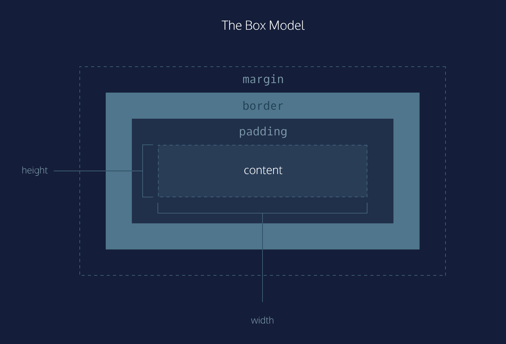

# Le modèle de la boîte

Le modèle de boîte comprend l'ensemble des propriétés qui définissent les parties d'un élément qui prennent de la place sur une page web. Le modèle comprend la taille de la zone de contenu (*largeur et hauteur*) et le *rembourrage*, la *bordure* et la *marge* de l'élément.
Les propriétés comprennent :

- `width` et `height`
  - spécifie la **largeur** et la *hauteur* de la zone de contenu.
  
- `padding` 
  - spécifie l'espace entre la zone de contenu et la bordure.
  
- `border`
  - spécifie l'épaisseur et le style de la bordure entourant la zone de contenu et le  `padding` (*rembourrage*).
  
- `margin`
  - spécifie la quantité d'espace entre la bordure et le bord extérieur de l'élément.
  
> L'image ci-dessous est une représentation visuelle du modèle de boîte.
___

___
## Hauteur & Largeur

Le contenu d'un élément a deux dimensions : une hauteur (`height`) et une largeur (`width`). 
Par défaut, les dimensions d'une boîte HTML sont définies pour contenir le contenu brut de la boîte.

Les propriétés de hauteur et de largeur du CSS peuvent être utilisées pour modifier ces dimensions par défaut.

```css
p {
  height: 80px;
  width: 240px;
}
```


Dans cet exemple, la hauteur et la largeur des "boîtes" qui contiennent les paragraphes sont fixées à 80 et 240 pixels, respectivement.

le `px` dans le code ci-dessus représente les pixels.

Les pixels vous permettent de définir la taille exacte de la boîte d'un élément (largeur et hauteur).

Lorsque la largeur et la hauteur d'un élément sont définies en pixels, il aura la même taille sur tous les appareils 
- un élément qui remplit l'écran d'un ordinateur débordera sur un écran mobile.

## A vous de jouer !

1. Reprendre le code [suivant](./versions-exercices/v0-8-1/)

2. Ajoutez une hauteur de 700 pixels à `#banner`.

3. Réglez la largeur de `.pull-quote` à 350 pixels.

4. Réglez la largeur de `#banner .content h1` à 400 pixels.


___

| [Précédent](../7-typographie/projet-brave-new-world/explications.md)       | [Suivant](./2-bordure.md)       |
