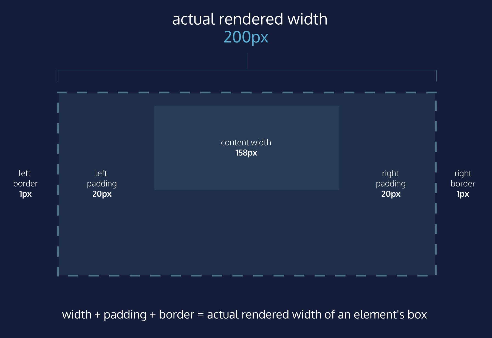

# Pourquoi changer le modèle de boîte ?


La leçon précédente s'est concentrée sur les aspects les plus importants du modèle de boîte : *dimensions*, *bordures*, *rembourrage* et *marge*.

Le modèle de la boîte, cependant, a une limite gênante en ce qui concerne ses dimensions. Cette limitation est illustrée au mieux par l'exemple suivant.

```html
<h1>Hello World</h1>
```


```css
h1 {
  border: 1px solid black;
  height: 200px;
  width: 300px;
  padding: 10px;
}
```

Illustration de ce code ci-dessous :  
<h1 style="border: 1px solid black; height: 200px;width: 300px; padding: 10px;">Hello World</h1>

___
Dans l'exemple ci-dessus, la boîte de l'élément titre a des bordures noires, d'une épaisseur de *1 pixel*. La hauteur de la boîte est de *200 pixels*, tandis que sa largeur est de *300 pixels*. Un rembourrage de 10 pixels a également été placé sur les quatre côtés du contenu de la boîte.
Malheureusement, dans le modèle de boîte actuel, l'épaisseur de la bordure et le `padding` affecteront les dimensions de la boîte.

Les *10 pixels* de rembourrage augmentent la hauteur de la boîte à *220 pixels* et la largeur à *320 pixels*. Ensuite, la bordure de *1 pixel* d'épaisseur augmente la hauteur à *222 pixels* et la largeur à *322 pixels*.

Dans ce modèle de boîte, l'épaisseur de la bordure et le `padding` sont ajoutés aux dimensions globales de la boîte. Il est donc difficile de déterminer avec précision les dimensions d'une boîte. Avec le temps, cela peut également rendre tout le contenu d'une page web difficile à positionner et à gérer.

De nombreuses propriétés dans le CSS ont une valeur par défaut et ne doivent pas être explicitement définies dans la feuille de style.

Par exemple, l'épaisseur de la police par défaut du texte est normal, mais cette paire propriété-valeur n'est généralement pas spécifiée dans une feuille de style.

On peut dire la même chose du modèle de boîte que les navigateurs supposent. En CSS, la propriété `box-sizing` contrôle le type de modèle de boîte que le navigateur doit utiliser lors de l'interprétation d'une page web.

La valeur par défaut de cette propriété est content-box. C'est le même modèle de boîte qui est affecté par l'épaisseur de la bordure et le rembourrage.
___

___
Heureusement, nous pouvons réinitialiser l'ensemble du modèle de boîte et en spécifier un nouveau : le modèle  **boîte-bordure**.

```css
* {
  box-sizing: border-box;
}
```


Le code de l'exemple ci-dessus réinitialise le modèle de boîte à border-box pour tous les éléments HTML. Ce nouveau modèle de boîte évite les problèmes dimensionnels qui existent dans l'ancien modèle de boîte dont vous avez entendu parler.

Dans ce modèle de boîte, la hauteur et la largeur de la boîte resteront fixes. L'épaisseur de la bordure et le rembourrage seront inclus à l'intérieur de la boîte, ce qui signifie que les dimensions globales de la boîte ne changent pas.

```html
<h1>Hello World</h1>
```
```css
* {
  box-sizing: border-box;
}

h1 {
  border: 1px solid black;
  height: 200px;
  width: 300px;
  padding: 10px;
}
```

Illustration de ce code ci-dessous :  
<h1 style="border: 1px solid black; height: 200px;width: 300px; padding: 10px; box-sizing: border-box;">Hello World</h1>

___

Dans l'exemple ci-dessus, la hauteur de la boîte reste à 200 pixels et la largeur à 300 pixels. L'épaisseur de la bordure et le rembourrage restent entièrement à l'intérieur de la boîte.


___
| [Précédent](./11-visibilite.md)       | [Suivant (Projet)](./los-pollos/explications.md)       |
