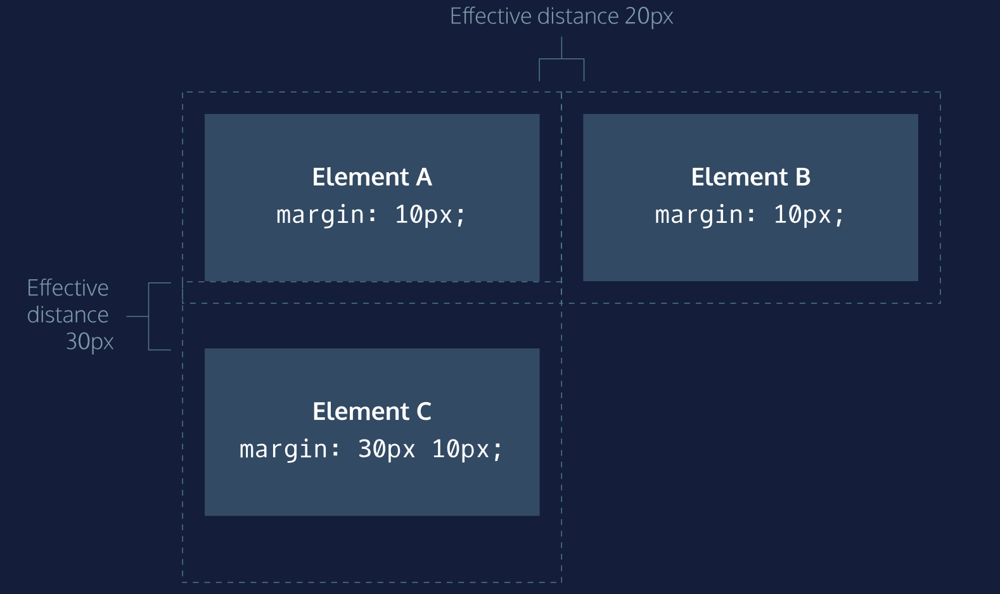

# Effondrement des marges

Comme vous l'avez vu, le `padding` est l'espace ajouté **à l'intérieur** de la bordure d'un élément, tandis que le `margin` est l'espace ajouté **à l'extérieur** de la bordure d'un élément.
Une différence supplémentaire est que les marges supérieures et inférieures, également appelées marges verticales, s'**effondrent**, alors que le rembourrage supérieur et inférieur ne s'effondrent pas.

Les marges horizontales (gauche et droite), comme le `padding`, sont toujours affichées et additionnées. Par exemple, si deux divs avec les ids `#div-one` et `#div-two`, sont l'un à côté de l'autre, ils seront aussi éloignés que la somme de leurs marges adjacentes.

```css
#img-one {
  margin-right: 20px;
}

#img-two {
  margin-left: 20px;
}
```

Dans cet exemple, l'espace entre les bordures `#img-one` et `#img-two` est de *40 pixels*. La marge droite de `#img-one` (`20px`) et la marge gauche de `#img-two` (`20px`) s'additionnent pour donner une marge totale de *40 pixels*.

Contrairement aux marges horizontales, les marges verticales ne s'additionnent pas. Au contraire, la plus grande des deux marges verticales fixe la distance entre des éléments adjacents.

```css
#img-one {
  margin-bottom: 30px;
}

#img-two {
  margin-top: 20px;
}
```

Dans cet exemple, la marge verticale entre les éléments `#img-one` et `#img-two` est de *30 pixels*. Bien que la somme des marges soit de *50 pixels*, la marge s'**effondre**, de sorte que l'espacement ne dépend que de la marge inférieure de l'élément qui a **la marge la plus grande** (ici : `img-one`).

Il peut être utile de considérer l'effondrement des marges verticales comme une personne de petite taille essayant de pousser une personne plus grande. La personne de grande taille a les bras plus longs et peut facilement pousser la personne de petite taille, tandis que la personne de petite taille ne peut pas atteindre la personne de grande taille.

En observant le graphique ci-dessous, on remarque que les éléments A et B ont une marge horizontale de 20 pixels, soit la somme des marges de chaque élément. Les éléments A et C ont une marge verticale de 30 pixels, soit la marge supérieure de l'élément C.
___

___
| [Précédent](./6-auto.md)       | [Suivant](./8-hauteur-min-max.md)       |
