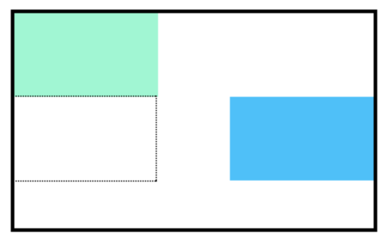

# Float

Jusqu'à présent, vous avez appris à spécifier la position exacte d'un élément en utilisant les propriétés de décalage.
Si vous souhaitez simplement déplacer un élément le plus à gauche ou le plus à droite possible sur la page, vous pouvez utiliser la propriété `float`.

La propriété `float`peut être fixée avec l'une de deux valeurs :

- `left` 
    - cette valeur déplacera, ou fera flotter, les éléments aussi loin que possible à gauche.
- `right` 
    - cette valeur déplacera les éléments aussi loin que possible vers la droite.

```css
.boxes {
  width: 120px;
  height: 70px;
}

.box-bottom {
  background-color: DeepSkyBlue;
  float: right;
}
```

Dans l'exemple ci-dessus, nous déplaçons l'élément `.box-bottom` vers la droite.
Cela fonctionne pour les éléments statiques et positionnés de manière relative. Voir le résultat du code ci-dessous :
___

___
Les éléments flottants doivent avoir une largeur spécifiée, comme dans l'exemple ci-dessus.
Dans le cas contraire, l'élément prendra toute la largeur de l'élément qui le contient, et la modification de la valeur flottante ne donnera aucun résultat visible.

## A vous de jouer !

1. Reprendre votre code.

2. Réglez la propriété `float` de l'élément `.answer` à `left`.

___
| [Précédent](./9-affichage-bloc-ligne.md)       | [Suivant](./11-clear.md)       |
