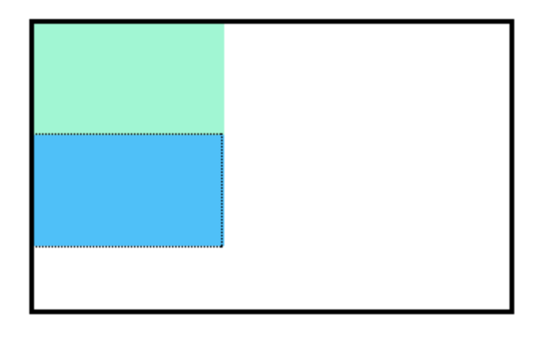

# Position

Regardez les éléments au niveau des blocs dans l'image ci-dessous :


___

Les éléments de niveau bloc comme ces boîtes créent un bloc de la largeur totale de leurs éléments parents, et ils empêchent d'autres éléments d'apparaître dans le même espace horizontal.
Les cases de l'image ci-dessus ont été créées avec le CSS suivant :

```css
.boxes {
  position: static;
  width: 120px;
  height: 70px;
}
```

et le HTML suivant :

```html
<div class="boxes"></div>
<div class="boxes"></div>
```

Remarquez que les éléments au niveau du bloc dans l'image ci-dessus prennent leur propre ligne d'espace et ne se chevauchent donc pas les uns les autres. 

La position par défaut d'un élément peut être modifiée en définissant sa propriété de position. La propriété de position peut prendre l'une des quatre valeurs suivantes

- `static` - la valeur par défaut (il n'est pas nécessaire de la préciser)
- `relative`
- `absolute`
- `fixed`

il est important de comprendre que si vous favorisez la position par défaut d'un élément HTML, vous n'avez pas besoin de définir sa propriété de position.


## A vous de jouer !

1. Reprendre le code [suivant](./versions-exercices/v0-9-2/)

2. Dans `style.css`, réglez la position de `.question` en `static`.

___
| [Précédent](./1-intro-positionnement.md)       | [Suivant](./3-relative.md)       |
