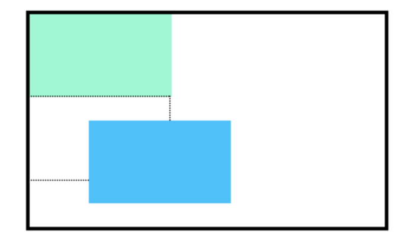

# Relative

Une façon de modifier la position par défaut d'un élément est de régler sa propriété  `position` sur `relative`.

Cette valeur vous permet de positionner un élément par rapport à sa position statique par défaut sur la page web.

```css
.box-bottom {
  background-color: DeepSkyBlue;
  position: relative;
}
```

Bien que le code dans l'exemple ci-dessus indique au navigateur de s'attendre à un positionnement relatif de la div, il ne précise pas où la div doit être positionnée sur la page.

```css
.box-bottom {
  background-color: DeepSkyBlue;
  position: relative;
  top: 20px;
  left: 50px;
}
```
Dans l'exemple ci-dessus, `<div>` a été positionné en utilisant deux des quatre propriétés de décalage. Les propriétés de décalage valides sont les suivantes :
1. `top` 
  - déplace l'élément vers le bas.
2. `bottom`
  - déplace l'élément vers le haut.
3. `left`
  - déplace l'élément vers la droite.
4. `right`
  - déplace l'élément vers la gauche.
  
Ici la balise `<div>` sera déplacé de *20 pixels* vers le bas et de *50 pixels* vers la droite à partir de sa position statique par défaut.
L'image ci-dessous montre la nouvelle position de la boîte.
La ligne pointillée représente l'endroit où la boîte positionnée statiquement (par défaut) a été positionnée.
___

___
Les unités des propriétés de décalage peuvent être spécifiées en pixels, en ems ou en pourcentages.
Notez que les propriétés de décalage ne fonctionneront pas si la valeur par défaut de `position` est `static`.

## A vous de jouer !

1. Reprendre votre code.

2. Dans `style.css`, fixer la propriété `position` à `relative` dans `.question`.

3. Baissez l'élément `.question` de 40 pixel.


___
| [Précédent](./2-position.md)       | [Suivant](./4-absolute.md)    |
