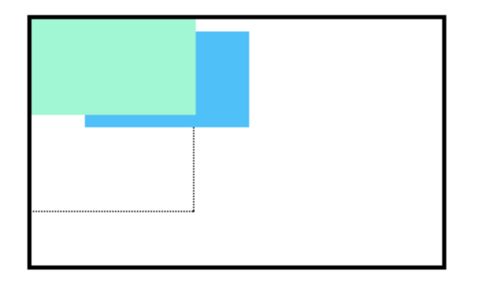

# Z-Index

Lorsque les cases d'une page web ont une combinaison de différentes positions, les cases (et donc leur contenu) peuvent se chevaucher les unes les autres, rendant le contenu difficile à lire.

```css
.box-top {
  background-color: Aquamarine;
}

.box-bottom {
  background-color: DeepSkyBlue;
  position: absolute;
  top: 20px;
  left: 50px;
}
```

Dans l'exemple ci-dessus, le `.box-bottom` ignore le `.box-top` et le recouvre au fur et à mesure du défilement de l'utilisateur.

La propriété `z-index` contrôle à quelle distance "arrière" ou "avant" un élément doit apparaître sur la page web lorsque des éléments se chevauchent. On peut penser à la profondeur des éléments, les éléments plus profonds apparaissant derrière les éléments moins profonds.

La propriété `z-index` accepte des valeurs entières. En fonction de leurs valeurs, les nombres entiers indiquent au navigateur l'ordre dans lequel les éléments doivent être affichés sur la page web.

```css
.box-top {
  background-color: Aquamarine;
  position: relative;
  z-index: 2;
}

.box-bottom {
  background-color: DeepSkyBlue;
  position: absolute;
  top: 20px;
  left: 50px;
  z-index: 1;
}
```

Dans l'exemple ci-dessus, nous avons réglé la position de `.box-top` sur `relative` et son `z-index` sur 2.
Nous avons changé sa position sur `relative`, car la propriété `z-indice` ne fonctionne pas sur les éléments statiques. `z-index` de 2 déplace l'élément `.box-top` vers l'avant, car il est plus grand que  `.box-bottom` ayant un `z-index` de 1.
Voir l'image d'exemple ci-dessous :
___

___
Sur l'image ci-dessus, vous pouvez voir que la boîte supérieure est déplacée devant la boîte inférieure.


## A vous de jouer !

1. Reprendre votre code.

2. Dans `style.css`, réglez le `z-index` de l'en-tête sur `10`. Remarquez que l'en-tête n'est plus couvert par d'autres éléments lorsque vous faites défiler !


___
| [Précédent](./5-position-fixed.md)       | [Suivant](./7-affichage-en-ligne.md)       |
