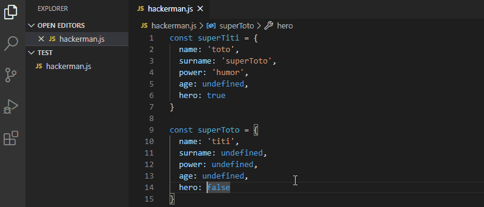

# Raccourcis utiles dans VSCode pour bien démarrer

Pour commencer voici le pdf qui donne les raccourcis les plus importants : [lien](https://code.visualstudio.com/shortcuts/keyboard-shortcuts-windows.pdf)  

## Les commandes les plus utiles à mon sens

- `Ctrl + :` => Commente la/les ligne sélectionnées
- `Ctrl + Maj + k` => Supprime la ou les ligne(s) sélectionnées (si le curseur est sur une ligne, la commande supprimera la ligne)
- `Alt + flèche haut/bas` => déplace la sélection
- `Alt + Clique gauche` => en restant appuyé sur `Alt` il est possible de dupliquer les curseurs (ce truc : `|` ) pour écrire à plusieurs endroits simultanément
- `Ctrl + D` => En gros c'est un `find and replace`. Cherche l'occurrence suivante de la sélection (si vous sélectionnez un mot, exemple : "php" , la commande sélectionnera le prochain mot "php" ET le curseur sera dupliqué également)

Voici un exemple en gif d'une utilisation de VSCode avec les raccourcis.

  
source : https://www.jesuisundev.com/gagne-du-temps-avec-visual-studio-code/
